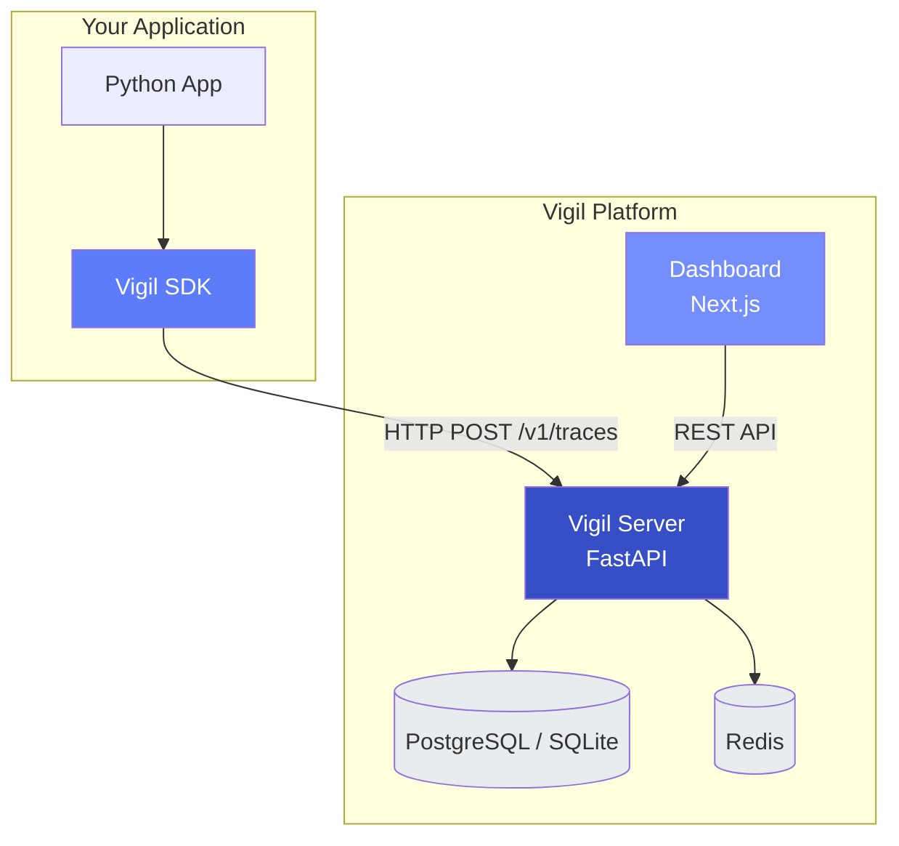

# Vigil Documentation

Vigil is a real-time observability platform for AI agent systems. It captures every LLM call, tool invocation, and decision your agents make — then lets you search, replay, and detect drift across your pipelines.

## Architecture Overview

## Components

| Component | Description | Tech |
|-----------|-------------|------|
| [SDK](sdk/README.md) | Python instrumentation library | Pydantic, httpx |
| [Server](server/README.md) | Trace ingestion and query API | FastAPI, SQLAlchemy |
| [Dashboard](dashboard/README.md) | Web UI for trace exploration | Next.js 15, React 19 |

## Quick Links

- [Getting Started](getting-started.md) — Install and capture your first trace in 5 minutes
- [Architecture](architecture.md) — Data flow, component diagrams, drift detection
- [API Reference](api-reference.md) — Every endpoint documented
