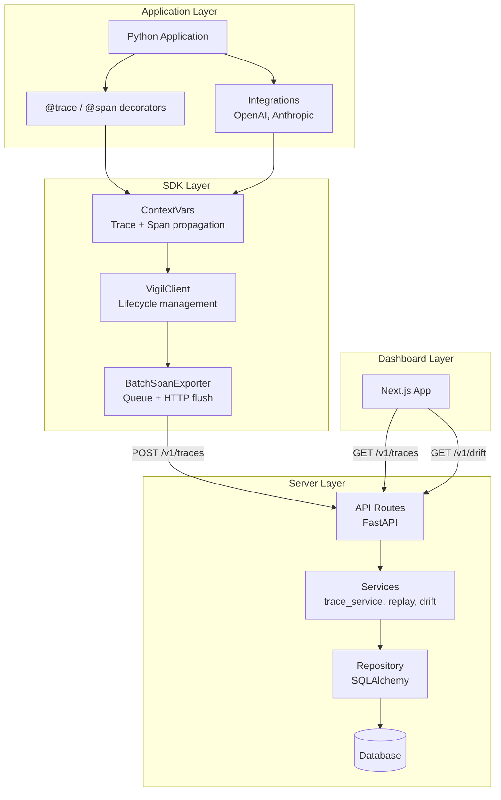
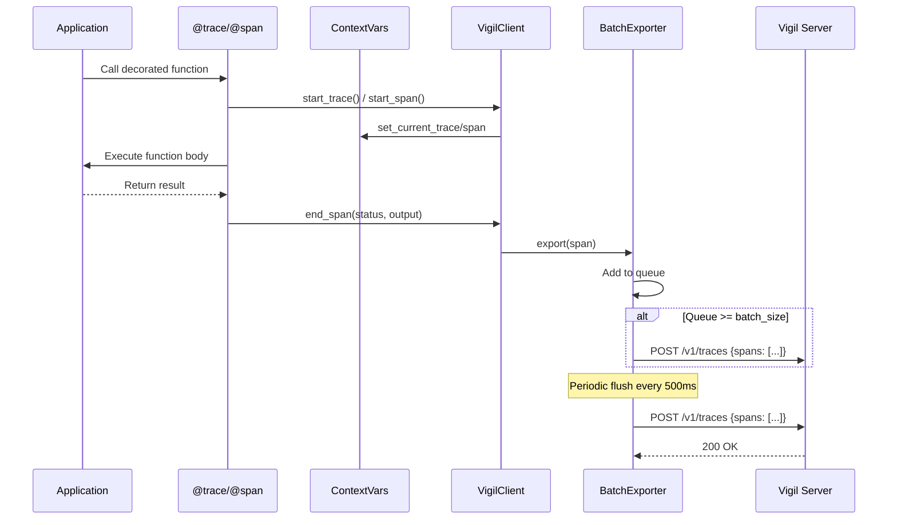
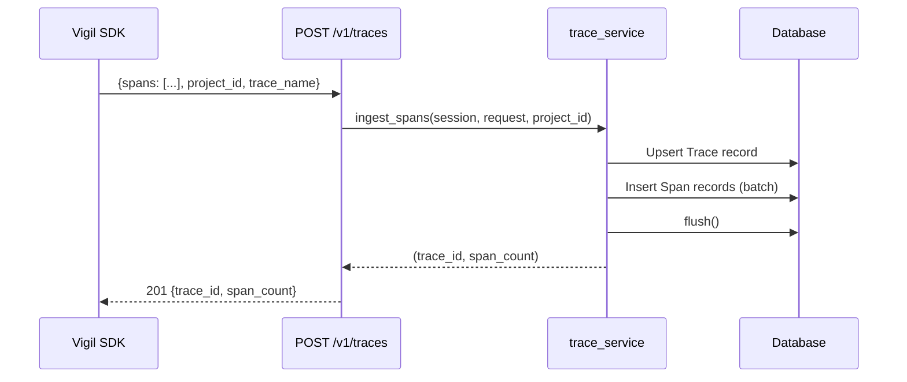
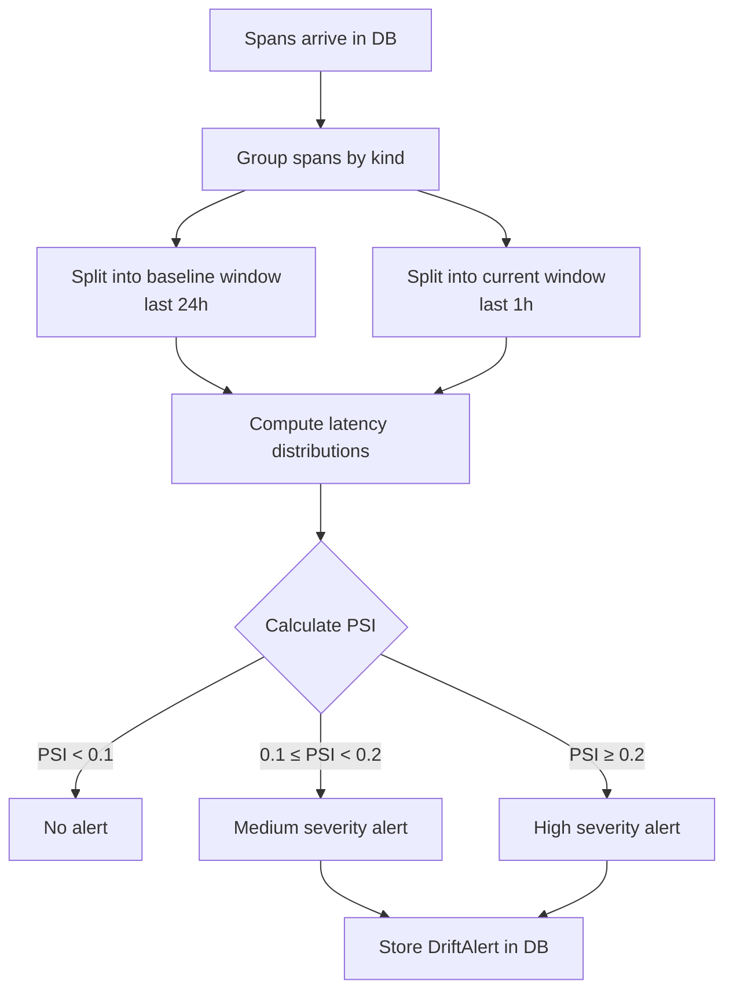
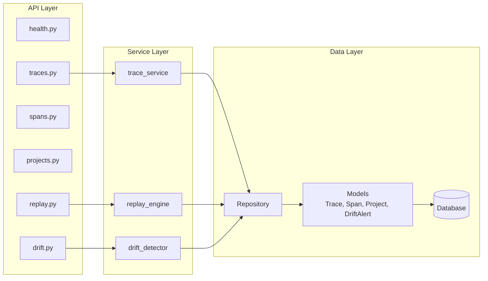
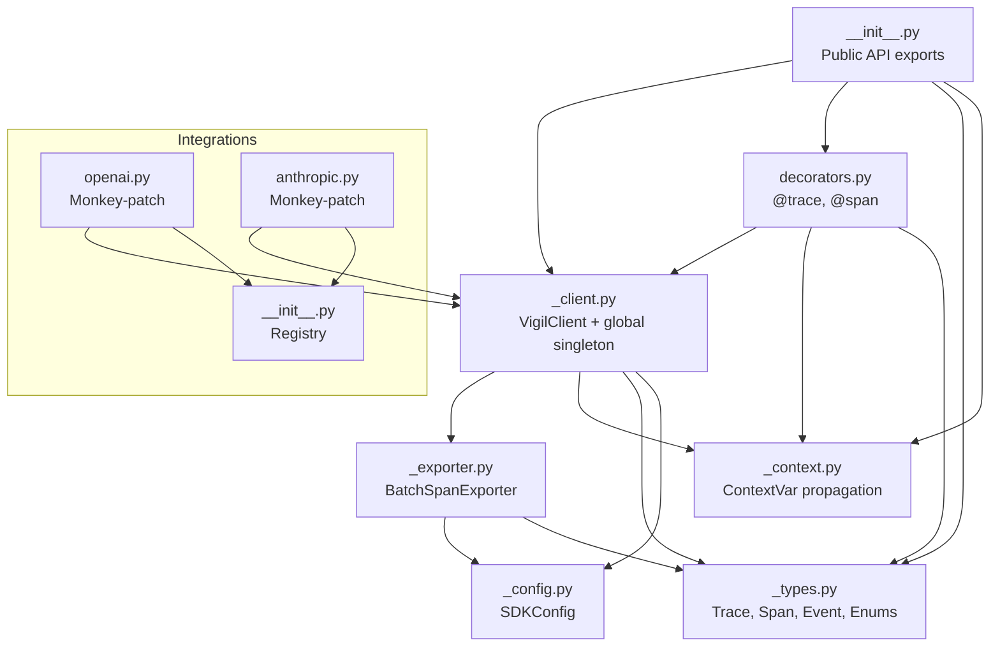

# Architecture

## System Architecture

```mermaid
graph TB
    subgraph "Application Layer"
        APP[Python Application]
        DEC["@trace / @span decorators"]
        INT[Integrations<br/>OpenAI, Anthropic]
        APP --> DEC
        APP --> INT
    end

    subgraph "SDK Layer"
        DEC --> CTX[ContextVars<br/>Trace + Span propagation]
        INT --> CTX
        CTX --> CLIENT[VigilClient<br/>Lifecycle management]
        CLIENT --> EXP[BatchSpanExporter<br/>Queue + HTTP flush]
    end

    subgraph "Server Layer"
        EXP -->|POST /v1/traces| API[API Routes<br/>FastAPI]
        API --> SVC[Services<br/>trace_service, replay, drift]
        SVC --> REPO[Repository<br/>SQLAlchemy]
        REPO --> DB[(Database)]
    end

    subgraph "Dashboard Layer"
        DASH[Next.js App] -->|GET /v1/traces| API
        DASH -->|GET /v1/drift| API
    end
```

## SDK Data Flow

```mermaid
sequenceDiagram
    participant App as Application
    participant Dec as @trace/@span
    participant Ctx as ContextVars
    participant Client as VigilClient
    participant Exp as BatchExporter
    participant Server as Vigil Server

    App->>Dec: Call decorated function
    Dec->>Client: start_trace() / start_span()
    Client->>Ctx: set_current_trace/span
    Dec->>App: Execute function body
    App-->>Dec: Return result
    Dec->>Client: end_span(status, output)
    Client->>Exp: export(span)
    Exp->>Exp: Add to queue
    alt Queue >= batch_size
        Exp->>Server: POST /v1/traces {spans: [...]}
    end
    Note over Exp: Periodic flush every 500ms
    Exp->>Server: POST /v1/traces {spans: [...]}
    Server-->>Exp: 200 OK
```

## Trace Ingestion Flow

```mermaid
sequenceDiagram
    participant SDK as Vigil SDK
    participant API as POST /v1/traces
    participant SVC as trace_service
    participant DB as Database

    SDK->>API: {spans: [...], project_id, trace_name}
    API->>SVC: ingest_spans(session, request, project_id)
    SVC->>DB: Upsert Trace record
    SVC->>DB: Insert Span records (batch)
    SVC->>DB: flush()
    SVC-->>API: (trace_id, span_count)
    API-->>SDK: 201 {trace_id, span_count}
```

## Drift Detection Flow

```mermaid
flowchart TD
    A[Spans arrive in DB] --> B[Group spans by kind]
    B --> C[Split into baseline window<br/>last 24h]
    B --> D[Split into current window<br/>last 1h]
    C --> E[Compute latency distributions]
    D --> E
    E --> F{Calculate PSI}
    F -->|PSI < 0.1| G[No alert]
    F -->|0.1 ≤ PSI < 0.2| H[Medium severity alert]
    F -->|PSI ≥ 0.2| I[High severity alert]
    H --> J[Store DriftAlert in DB]
    I --> J
```

## Server Layer Architecture

```mermaid
graph LR
    subgraph "API Layer"
        H[health.py]
        T[traces.py]
        S[spans.py]
        P[projects.py]
        R[replay.py]
        D[drift.py]
    end

    subgraph "Service Layer"
        TS[trace_service]
        RE[replay_engine]
        DD[drift_detector]
    end

    subgraph "Data Layer"
        REPO[Repository]
        MOD[Models<br/>Trace, Span, Project, DriftAlert]
        DB[(Database)]
    end

    T --> TS
    R --> RE
    D --> DD
    TS --> REPO
    RE --> REPO
    DD --> REPO
    REPO --> MOD
    MOD --> DB
```

## SDK Component Relationships

```mermaid
graph TD
    INIT["__init__.py<br/>Public API exports"] --> CLIENT["_client.py<br/>VigilClient + global singleton"]
    INIT --> DEC["decorators.py<br/>@trace, @span"]
    INIT --> TYPES["_types.py<br/>Trace, Span, Event, Enums"]
    INIT --> CTX["_context.py<br/>ContextVar propagation"]

    CLIENT --> EXP["_exporter.py<br/>BatchSpanExporter"]
    CLIENT --> CTX
    CLIENT --> TYPES
    CLIENT --> CFG["_config.py<br/>SDKConfig"]

    DEC --> CLIENT
    DEC --> CTX
    DEC --> TYPES

    EXP --> CFG
    EXP --> TYPES

    subgraph "Integrations"
        REG["__init__.py<br/>Registry"]
        OAI["openai.py<br/>Monkey-patch"]
        ANT["anthropic.py<br/>Monkey-patch"]
    end

    OAI --> CLIENT
    ANT --> CLIENT
    OAI --> REG
    ANT --> REG
```
